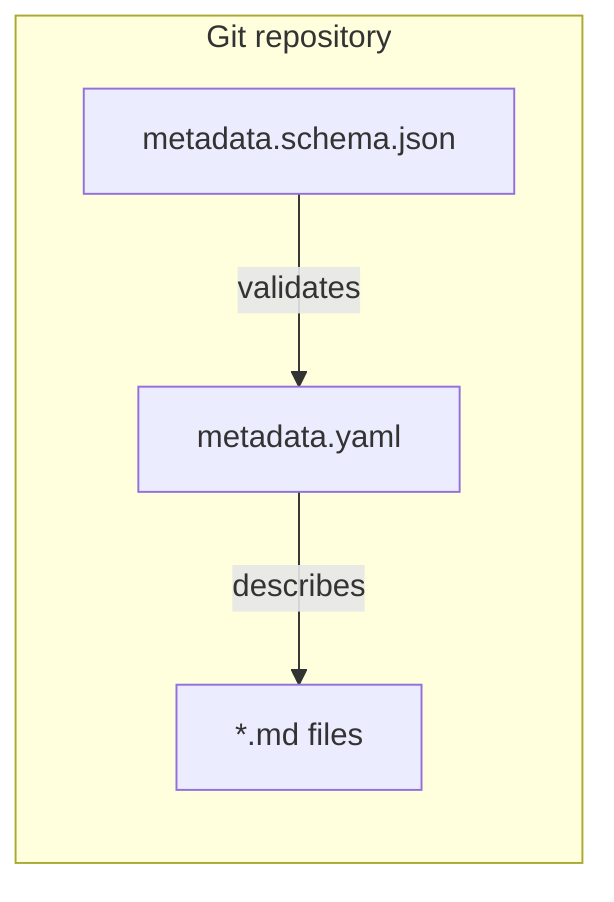
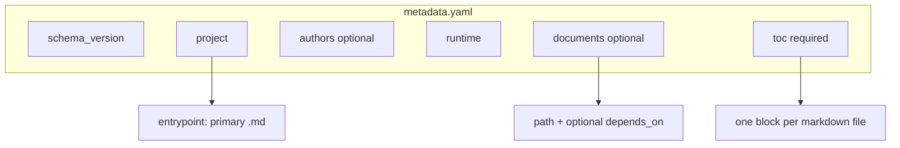
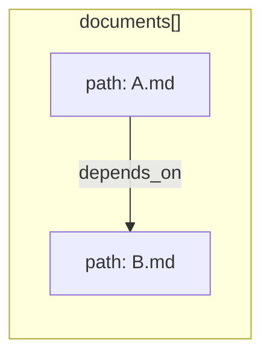
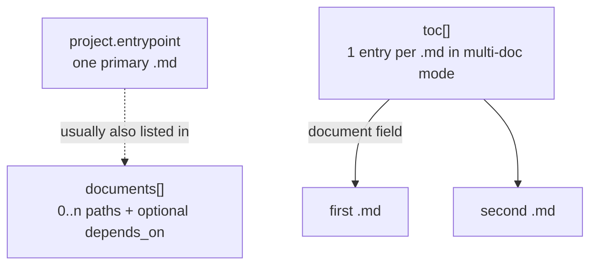
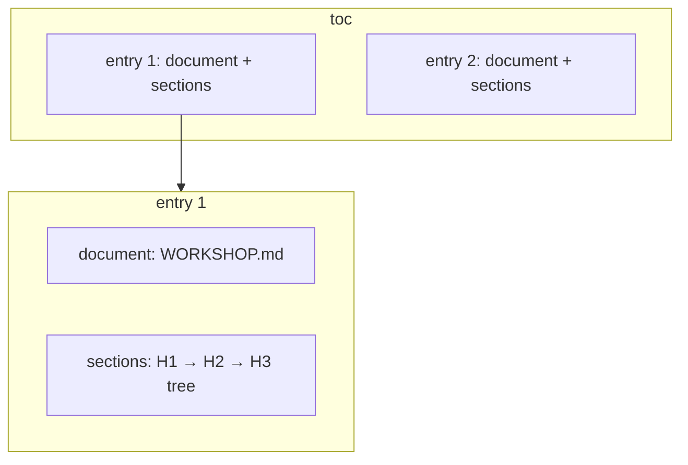
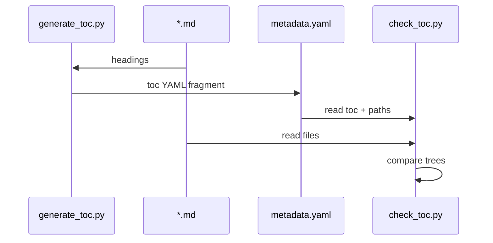
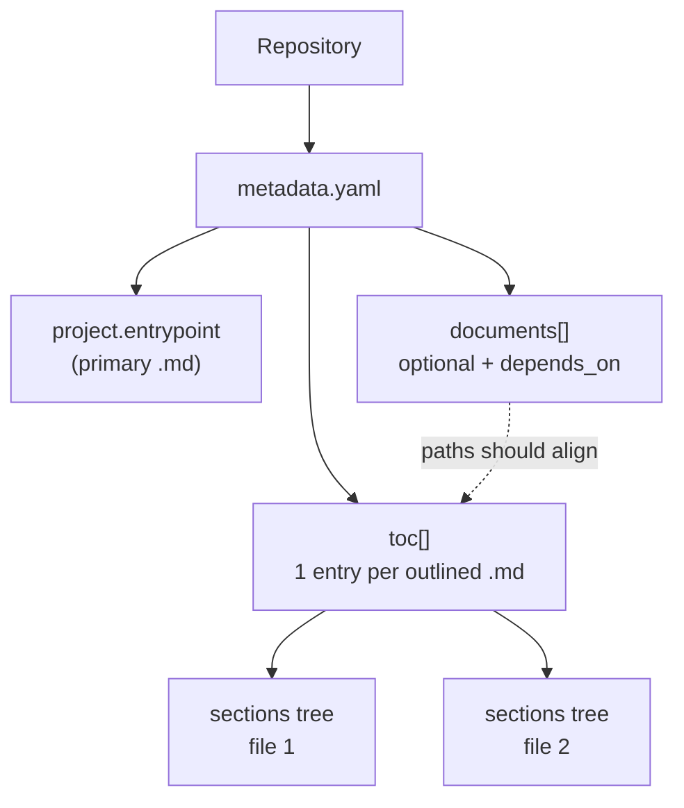

# Repository structure

This document describes how a **single metadata file** describes **one workshop or content repository**: project identity, declared markdown documents, the default **entrypoint**, and a **table of contents** aligned with those files.

### Viewing these diagrams

| Where | How |
|-------|-----|
| **Local browser** | Open [`structure-diagrams.html`](structure-diagrams.html) in this folder: all flowcharts on one page (dark theme, jump links). |
| **GitHub** | This file (`docs/STRUCTURE.md` in **workshop-metadata-tools**) renders fenced `mermaid` blocks in the repo view. |
| **Editor** | Markdown preview with Mermaid support (VS Code / Cursor extensions). |

---

## 1. One repository, one metadata file

Each repository is expected to expose **exactly one** machine-readable manifest at the root (conventionally `metadata.yaml`). All paths inside it are interpreted **relative to the directory that contains `metadata.yaml`**.



| Rule | Meaning |
|------|--------|
| **1 repo → 1 metadata** | A single YAML file is the source of truth for structure and tooling. |
| **Schema** | `metadata.schema.json` constrains the shape of `metadata.yaml` (editors can use the `# yaml-language-server: $schema=...` hint). |

---

## 2. Contents of `metadata.yaml` (overview)

At a high level, the metadata file groups **identity**, **runtime**, **declared documents**, and **navigation (TOC)**.



| Section | Cardinality | Role |
|---------|-------------|------|
| `schema_version` | `1` | Version of the metadata **shape** (not the workshop content). |
| `project` | `1` | Slug, name, summary, and **`entrypoint`**: the **primary** markdown file (e.g. landing or first screen in a UI). |
| `authors` | `0..1` | Optional list of people. |
| `runtime` | `1` | Execution context (e.g. engine + language). |
| `documents` | `0..*` | Declares **which `.md` files** exist in the repo and optional **reading order** constraints. |
| `toc` | `1` | **Navigation tree**: in the modern shape, **one entry per document** that has a TOC. |

---

## 3. Documents: `1..n` markdown files

A **document** is a **`.md` file** referenced by path. The optional `documents` array is the declarative list of those files and optional **dependencies** (other `.md` files to read first).



Example (conceptual):

- `A.md` — no prerequisites.
- `B.md` — `depends_on: [A.md]` means **read `A.md` before `B.md`** for the intended learning path.

Paths use **POSIX-style** strings (e.g. `folder/note.md`) and are resolved from the **metadata file’s directory**.

---

## 4. Entrypoint vs documents vs TOC

Three ideas work together:

| Concept | Purpose |
|---------|--------|
| **`project.entrypoint`** | **Single** primary document: default entry when opening the repo or starting the workshop. |
| **`documents`** | **Optional** catalog of **all** relevant `.md` files and **optional** `depends_on` edges (prerequisites). |
| **`toc`** | **Required** navigation: **one TOC entry per markdown file** you want in the outline (modern form). |



**Consistency (recommended):** every `toc[].document` should correspond to a real `.md` file next to `metadata.yaml`. The **entrypoint** should be one of those files (typically the first in reading order). Listing a file in `documents` without a `toc` entry is allowed if that file is not part of the navigable outline.

---

## 5. Table of contents: `toc` — one entry per document

In the **current (multi-document) model**, `toc` is a **list of objects**, each with:

- **`document`**: path to a `.md` file (same path convention as elsewhere).
- **`sections`**: a **tree of headings** extracted from that file (`title`, optional `cf_code`, optional `competency_path` / `competency`, nested `parts`), mirroring `#` / `##` / `###` … structure in the markdown. See [`competency_path_notation.md`](competency_path_notation.md).



So: **`len(toc)`** in this mode equals the **number of markdown files** you expose in the combined outline (not counting legacy single-file mode).

### Legacy `toc` (single file)

For older data, `toc` may be a **flat list of sections** (no `document` / `sections` wrapper). In that case the **single** markdown file is **`project.entrypoint`**, and the whole list is the section tree for that file.

---

## 6. Tooling

Scripts are maintained in the shared repository [**workshop-metadata-tools**](https://github.com/kevin-cazal/workshop-metadata-tools) (not copied into each workshop). Typical scripts:

| Script | Role |
|--------|------|
| `generate_toc.py` | Reads one or more `.md` files and prints YAML for **`toc`** (one `{ document, sections }` per file). Headings inside fenced code blocks are ignored. |
| `sync_metadata_toc.py` | Creates or updates **`metadata.yaml`**, including regenerating **`toc`** from Markdown headings. |
| `generate_readme.py` | Writes **`README.md`** from `metadata.yaml` (project, authors, runtime, documents, toc outline, observables). |
| `check_toc.py` | Loads `metadata.yaml`, resolves each `toc` document path, recomputes heading trees from disk, and compares them to **`sections`**. Validates every listed document in one run. |
| `parse_quiz.py` / `quiz_lib.py` | Parses **quiz** blockquotes (`> QUIZ.…`); quizzes are stripped before TOC extraction — see **`docs/QUIZ.md`**. |



**End-to-end overview** (how the pieces connect):



---

## 7. Typical file layout

```text
workshop repository/           # subject template: workshop content only
├── metadata.yaml              # single manifest
├── WORKSHOP.md                # (example) markdown sources
├── README.md                  # generated from metadata.yaml (do not edit by hand)
├── TEMPLATE.md                # optional: how to use the GitHub template
└── .github/workflows/verify-metadata.yaml   # calls reusable CI

workshop-metadata-tools/       # shared tooling + JSON Schema + this doc
├── metadata.schema.json       # canonical JSON Schema (editors: $schema URL in metadata.yaml)
├── docs/STRUCTURE.md          # this document
├── docs/structure-diagrams.html
└── …
```

Shared Python tooling and schema: [**workshop-metadata-tools**](https://github.com/kevin-cazal/workshop-metadata-tools).

---

## 8. Summary

| Invariant | Statement |
|-----------|-----------|
| **Repo ↔ metadata** | One repository, one `metadata.yaml` as the structural entry point. |
| **Entrypoint** | Exactly one `project.entrypoint` marking the primary `.md` file. |
| **Documents** | Zero or more declared `.md` paths, optionally with `depends_on` prerequisites. |
| **TOC** | Required; in multi-document mode, **`toc` has one item per outlined `.md`**, each with `document` + `sections` matching headings in that file. |

For field-level constraints (types, patterns, `oneOf` for legacy `toc`), see **`metadata.schema.json`** in the [**workshop-metadata-tools**](https://github.com/kevin-cazal/workshop-metadata-tools) repository (or the `$schema` URL in your `metadata.yaml`).
